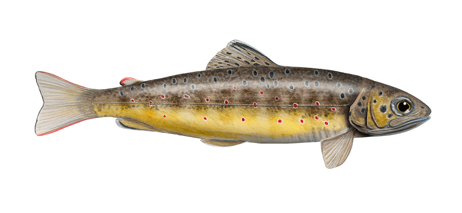

Scripts rédigés par : 

- Manon Halouin
- Eva Teleitchea
- Julien Roes
- Nathan Leclerc

# Contexte du projet 

Ce projet tutoré, encadré par Mathias Vignon et Maxime Descat, vise à caractériser la nage de *Salmo trutta* (truite fario) à travers l'analyse de séquences vidéos de nage. L'ensemble de ce projet nécessite le traitement et l'analyse de données qui ont été fait sur le logiciel R. L'ensemble des scripts et données utlisées sont versionné et stocké au sein d'un projet Github privé.

## Structure du projet

Les scripts ont été construits selon une suite logique permettant de passer de la préparation des données à l'analyse statistique et à la visualisation des résultats. À quasiment chaque script et si nécessaire, un Rdata est enregistré et utilisé dans le script utilisé chronologiquement après. 

# Détail dans l'ordre chronologique des scripts 

- 00_GIF.R : ce script a pour objectif de créer un GIF à partir de plusieurs images (extraites de vidéos) pour visualiser les différentes séquences de nage steady stationnaire et mobiles.

- 00_TEST_ENVELOPPE.R : ce script a pour objectif de tester la fonction d'enveloppe pour visualiser les différentes séquences de nage steady stationnaire et mobiles.

- 00_VARIATION_TETE.R : ce script a pour objectif de visualiser la variation de la position de la tête sur les différents segments 

- 00_VISUALISATION_ENVELOPPE_M et 00_VISUALISATION_ENVELOPPE_S : ces scripts ont pour objectif de visualiser les différentes séquences de nage steady stationnaire et mobiles

- 01_DONNEES.R : ce script a pour objectif de rassembler les données pour constituer le jeu de données à utiliser pour le modèle GAMM

- 02_S_STANDARDISATION.R et 02_M_STANDARDISATION.R : ce script a pour objectif de standardiser les données pour constituer le jeu de données à utiliser pour le modèle GAMM pour les séquences steady stationnaire et mobiles respectivement

- 03_CLASSES_VITESSE.R : ce script a pour objectif de donner un aperçu des différentes classes de vitesses repérées sur l'ensemble des vidéos décortiquées dans le but de ne choisir qu'une intervalle similaire

- 04_ORDINATION.R : ce script a pour objectif de faire une ordination pour visualiser extraire les variables les plus importantes et explicatives 

- 04bis_NMDS : ce script a pour objectif de faire une NMDS pour visualiser les différences et similarités entre traitement AM et AV et mobiles et stationnaires

- 05_GAMM.R : ce script a pour objectif de construire le modèle GAMM pour différencier l'effet des traitements

- 06_VIO.R : ce script a pour objectif d'estimer la variabilité inter-opérateur sur l'étape de traçage des points de la tête et de la queue

  

© Pixels⎥ Urft Art Valley

